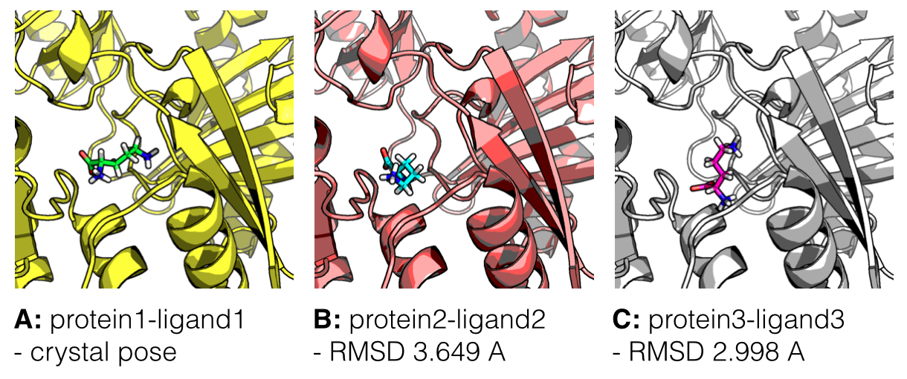

#### About this repository
[[back to top](#about-this-repository)]

During my work and hobbies, I started accumulating useful material about different topics in Protein-Science, which I wanted to collect in a central place and share with others in hope that it might serve as a useful reference one day.

 
 

- [Software Quick Guides](./scripts-and-tools/more_protein-science_tools.md)
- [Tutorials](#tutorials)
    - [Substructure Alignment Using OpenEye OEChem RMSD](#substructure-alignment-using-openeye-oechem-rmsd)
    - [Low-Energy Conformer Generation and Overlay](#low-energy-conformer-generation-and-overlay)
	- [Molecular docking, estimating free energies of binding, and AutoDock's semi-empirical force field](#molecular-docking-estimating-free-energies-of-binding-and-autodocks-semi-empirical-force-field)

- [Scripts and Tools](#scripts-and-tools)
- [Info Sheets](#info-sheets)
- [Literature](#literature)
- [Protein Science Glossary](#protein-science-glossary)
- [Useful Links](#useful-links)

 
 

#### I am looking forward to your contributions, suggestions, and ideas
[[back to top](#about-this-repository)]

If you have any suggestions or want to make additions, I would be very happy if you could send me  

- an [email](mailto:se.raschka@gmail.com),  
- leave me a message on [google+](https://plus.google.com/118404394130788869227/),   
- or even send me a tweet on [twitter](https://twitter.com/rasbt) (given you can fit it within the 140 character limit ;)).  

Or even better: It would be great if you would simply fork this project and send me a pull request.

 
 
 
 

# Tutorials
[[back to top](#about-this-repository)]

### Substructure Alignment Using OpenEye OEChem RMSD
[[back to top](#about-this-repository)]

A how-to for extracting a substructure from a molecule and use it as query for an alignment to target molecules.  
[Link to tutorial](./tutorials/substructure_alignment/README.md)

 

### Low-Energy Conformer Generation and Overlay
[[back to top](#about-this-repository)]

Tutorial and script to generate low-energy conformers of query and target molecules and overlay them to choose the highest-scoring hit using OpenEye software.  
[Link to tutorial](./tutorials/low_energy_conformer_overlay/README.md)

 

### Molecular docking, estimating free energies of binding, and AutoDock's semi-empirical force field

[[back to top](#about-this-repository)]

Discussions and questions about methods, approaches, and tools for estimating (relative) free binding energies of protein-ligand complexes are quite popular, and even the simplest tools can be quite tricky to use. Here, I want to briefly summarize the idea of molecular docking, and give a short overview about how we can use AutoDock 4.2's hybrid approach for evaluating binding affinities.  

[Link to tutorial](./tutorials/scoring_functions_and_autodock/2014_autodock_energycomps.md)

 
 
 

# Scripts and Tools
[[back to top](#about-this-repository)]

- A useful [one-liner cheatsheet](./scripts-and-tools/oneliner.md) for quick and simple commands for working with protein structure files.

- the **[`scripts-and-tools`](./scripts-and-tools)** subdirectory with tools for, e.g., 
	- calculating the center of mass of protein and ligands
	- converting PDB files into FASTA strings
	- calculating the RMSD between two molecules
	- extracting coordinates from PDB files 

- **[smilite](https://github.com/rasbt/smilite)** - a Python module to download and analyze SMILE strings (Simplified Molecular-Input Line-entry System) of chemical compounds from ZINC

- **[pyprot](https://github.com/rasbt/pyprot)** - a Python package for working with protein structure files formats. It comes with a collection of ready-to-use scripts for the most common file operations and protein analyses.

- **[PDB Info Table](https://github.com/rasbt/datacollect/tree/master/pdb_infotable)** - A simple command line tool that creates an info table from a list of PDB files.

 
 
 

# Info Sheets
[[back to top](#about-this-repository)]

- Iridium dataset of high-quality protein structures [PDB code quickreference](./info_sheets/Iridium_pdb_codes.md)

 
 

# Literature

[[back to top](#about-this-repository)]

- [Literature overview and summaries](./literature/literature_summaries.md)

 
 

# [Protein Science Glossary](./glossary/README.md)
[[back to top](#about-this-repository)]

 
 

# Useful Links
[[back to top](#about-this-repository)]

- [ZINC](http://zinc.docking.org)  
 A free database for > 35 million purchasable chemical compounds for virtual screening.
 
- [RCSB Protein Data Bank (PDB)](http://www.rcsb.org)  
The world's largest repository for downloadable 3D structures of biological molecules, including protein nucleic acid (DNA) structures.

- [EMBL-EBI PDBsum](http://www.ebi.ac.uk/pdbsum/)  
A Pictorial database of 3D structures in the Protein Data Bank that provides additional useful information, e.g., visualization between protein-ligand interactions.

- [Ligscore - Pose & Rank](http://modbase.compbio.ucsf.edu/ligscore/)  
A web server for scoring protein-ligand complexes based on statistical potentials.

