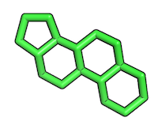
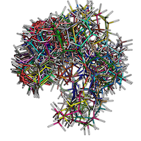

# Tutorials

### Substructure Alignment Using OpenEye OEChem RMSD

A how-to for extracting a substructure from a molecule and use it as query for an alignment to target molecules.  
[Link to tutorial](./tutorials/substructure_alignment/README.md)

### Low-Energy Conformer Generation and Overlay

Tutorial and script to generate low-energy conformers of query and target molecules and overlay them to choose the highest-scoring hit using OpenEye software.  
[Link to tutorial](./tutorials/low_energy_conformer_overlay/README.md)

 
 
 

# Scripts and Tools

Useful scripts for working with protein files in FASTA, PDB, and MOL2 formats

Please visit [`scripts-and-tools`](./scripts-and-tools) subdirectory for documentation and examples.

#### Other tools
- **[smilite](https://github.com/rasbt/smilite)** - a Python module to download and analyze SMILE strings (Simplified Molecular-Input Line-entry System) of chemical compounds from ZINC

- **[pyprot](https://github.com/rasbt/pyprot)** - a Python package for working with protein structure files formats. It comes with a collection of ready-to-use scripts for the most common file operations and protein analyses.

 
 
 

# Info Sheets

- Iridium dataset of high-quality protein structures [PDB code quickreference](./info_sheets/Iridium_pdb_codes.md)

 
 

# [Recommended Literature](./literature/README.md)

 
 

# [Protein Science Glossary](./glossary/README.md)

 
 

# Useful Links

- [ZINC](http://zinc.docking.org)  
 A free database for > 35 million purchasable chemical compounds for virtual screening.
 
- [RCSB Protein Data Bank (PDB)](http://www.rcsb.org)  
The world's largest repository for downloadable 3D structures of biological molecules, including protein nucleic acid (DNA) structures.

- [EMBL-EBI PDBsum](http://www.ebi.ac.uk/pdbsum/)  
A Pictorial database of 3D structures in the Protein Data Bank that provides additional useful information, e.g., visualization between protein-ligand interactions.

- [Ligscore - Pose & Rank](http://modbase.compbio.ucsf.edu/ligscore/)  
A web server for scoring protein-ligand complexes based on statistical potentials.
