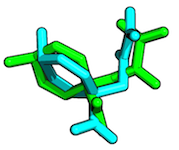

Sebastian Raschka

Last updated: 07/22/2014

#Table of Contents
- [Apo structure](#apo-structure)
- [Conformation](#conformation)
- [High-throughput screening](#high-throughput-screening)
- [Holo structure](#holo-structure)
- [Orientation](#orientation)
- [Pose](#pose)
- [Root-mean-square deviation (RMSD)](#root-mean-square-deviation-rmsd)
- [Virtual screening](#virtual-screening)

 
 

#### Apo structure 

[[back to top](#table-of-contents)]

The observed structure of a protein if its ligand is not bound. In contrast to [holo structure](#holo-structure)

#### Conformation   
[[back to top](#table-of-contents)]

- Ligands/proteins can exist in different conformations. Usually, "conformation" refers to the same chemical composition but with altered bond-angles between two/multiple ligands or proteins. See also [orientation](#orientation).

#### High-throughput screening   

[[back to top](#table-of-contents)]  

High-throughput screening (HTS) is an experimental (in contrast to virtual screening) approach for drug discovery that were especially popular in the 1980's and 1990's. HTS uses automated mechanical devices, such as roboters, in order to test up to millions of chemical compounds for activity.

#### Holo structure    

[[back to top](#table-of-contents)]

The observed structure of a protein in its ligand bound state. In contrast to [apo structure](#apo-structure).

#### Orientation

[[back to top](#table-of-contents)]

- In contrast to [conformation](#conformation), the bond angles are the same between two/multiple ligands (as well as the chemical composition), but the orientation in space (transition, global rotation) is differs between two/multiple orientations.

#### Pose  

[[back to top](#table-of-contents)]

A ligand pose describes the binding-mode of a ligand in a protein binding site. Typically, this is considered to be a combination of [orientation](#orientation) & [conformation](#conformation)

#### Root-mean-square deviation (RMSD) 

[[back to top](#table-of-contents)]

The RMSD measures the average distance between atoms of 2 protein or ligand structures via the equation

where *a_i* refers to the atoms of molecule 1, and *b_i* to the atoms of molecule 2, respectively. The subscripts *x, y, z* are denoting the x-y-z coordinates for every atom.

The RMSD is most commonly calculated without taking hydrogen-atoms into consideration (typically only C-alpha or main-chain atoms in proteins).

(overlay between 2 ligand structures, RMSD = 1.9959 Angstrom)

#### Virtual screening

[[back to top](#table-of-contents)]

Virtual screening (VS) is a computer-aided, knowledge-driven approach for drug-discovery (in contrast to the experimental High-throughput screening (HTS)). Typically, a large database of small, drug-like compounds is screened for molecules that can fit into a protein-receptor binding interface.
