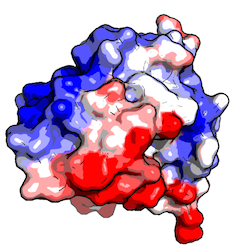
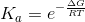
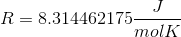
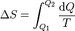
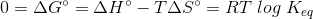
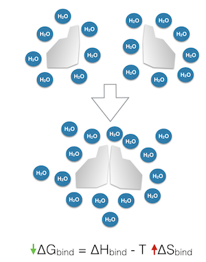
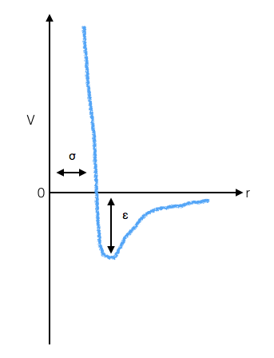
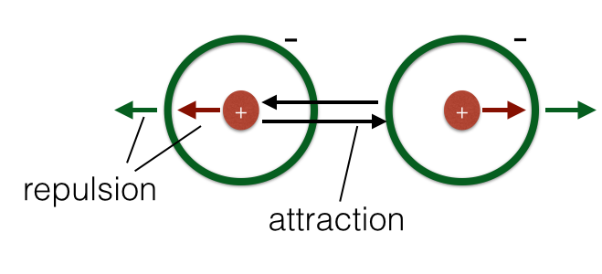

Sebastian Raschka

Last updated: 08/19/2014

#Table of Contents
- [Apo structure](#apo-structure)
- [B-factor](#b-factor)
- [Binding affinity](#binding-affinity)
- [Conformation](#conformation)
- [Conformation Entropy](#conformation-entropy)
- [Entropy](#entropy)
- [Gibbs Free Energy](#gibbs-free-energy)
- [High-throughput screening](#high-throughput-screening)
- [Hydrophobic interaction](#hydrophobic-interaction)
- [Holo structure](#holo-structure)
- [Lennard-Jones Potential](#lennard-jones-potential)
- [Molecular Mechanics and Molecular Dynamics](#molecular-mechanics-and-molecular-dynamics)
- [Orientation](#orientation)
- [Pose](#pose)
- [Protein folding core](#protein-folding-core)
- [R-factor](#r-factor)
- [Root-mean-square deviation (RMSD)](#root-mean-square-deviation-rmsd)
- [Van der Waals force](#van-der-waals-force)
- [Virtual screening](#virtual-screening)

 

- [References](#references)

 
 

#### Apo structure 

[[back to top](#table-of-contents)]

The observed structure of a protein if its ligand is not bound. In contrast to [holo structure](#holo-structure)

 
 

#### B-factor 

[[back to top](#table-of-contents)]

The B-factor (original name: Debye-Waller factor) is sometimes also called temperature factor, since it describes the thermal mobility of an atom based on the amount of scatter in the X-ray crystallographic experiment.

High B-factor values are usually associated with high mobility of an atom. However, a high B-factor value must not necessarily be associated with a flexible region, but can also indicate experimental uncertainty (i.e., positional errors).  
Typical B-factor values are around 15-20 A2.

The image above shows a protein (inorganic pyrophosphatase, [3eiy](http://www.rcsb.org/pdb/explore.do?structureId=3EIY)) colored by its B-factor values (PyMol command: `spectrum b, blue_white_red, minimum=20, maximum=50`).

 
 

#### Binding affinity

[[back to top](#table-of-contents)]

Binding affinity describes the strength of intermolecular interactions in a binding interface between a ligand (typically, a small chemical compound) and a protein binding site. The components of intermolecular interactions are composed of electrostatic interactions (ionic bonds), hydrogen bonds, and [van der Waals forces](#van-der-waals-forces).

The binding affinity is defined by the following equation:

with 

the ideal gas constant:  
 

*T* = Temperature

*&Delta;G* = [Gibbs Free Energy](#gibbs-free-energy)

 
 

#### Conformation   
[[back to top](#table-of-contents)]

Ligands/proteins can exist in different conformations. Usually, "conformation" refers to the same chemical composition but with altered bond-angles between two/multiple ligands or proteins. See also [orientation](#orientation).

 
 

#### Conformation Entropy
[[back to top](#table-of-contents)]

In the studies of macromolecules, conformational [entropy](#entropy) is often used synonymous to configurational entropy, which refers to the positional states of particles considering the underlying energy distribution of the system.  
In practice, the entropy of a macromolecular is often assessed by evaluating the number of rotamers ([conformation](#conformation)s that arise upon the rotation of single rotatable bonds) that can occur considering constraints such as bond angles (assessed via energy levels). Based on the energy levels, the probability (occcupancy) of a state can be calculated.

 
 

#### Entropy  
[[back to top](#table-of-contents)]

The most common interpretation is that entropy describes the degree of disorder of a closed thermodynamic system. According to the second law of thermodynamics, entropy increases in such a closed thermodynamic system over time until it reaches thermodynamic equilibrium where the entropy it at maximum.  
Here, the definition of "disorder" can be understood as the number of combinations of microstates that yield a equivalent macrostate. 

*S = kB ln &Omega;*

where 
S = entropy  
&Omega; = total number of possible microstates  
kB = Boltzmann constant

The change in entropy in a thermodynamic system is often described as:

where  
T = temperature  (constant)  
Q = heat

 
 

#### Gibbs Free Energy 

[[back to top](#table-of-contents)]  

Gibbs Free Energy is often used to describe the thermodynamic potential of a chemical reaction where a negative value is considered as "favorable", and a positive value is considered as "unfavorable", respectively.

For constant temperature, the change of the Gibbs Free Energy is defined as 

&Delta;H = Enthalpy change  
&Delta;S = Entropy change  
T = temperature

And under equilibrium conditions, the Gibbs Free Energy can be reformulated as

where *Keq* is the equilibrium constant.

 
 

#### High-throughput screening   

[[back to top](#table-of-contents)]  

High-throughput screening (HTS) is an experimental (in contrast to virtual screening) approach for drug discovery that were especially popular in the 1980's and 1990's. HTS uses automated mechanical devices, such as robots, in order to test up to millions of chemical compounds for activity.

 
 

#### Hydrophobic interaction   

[[back to top](#table-of-contents)]  

Hydrophobic interactions are occurring between molecules that have a low water solubility: Those molecules tend to "clump" together in aqueous solutions in order to decrease the surface area that is exposed to the surrounding water molecules.

In the context of binding free energies (see [Gibbs Free Energy](gibbs-free-energy)), hydrophobic interactions between two molecules are entropically (not enthalpically)  favorable by causing the release of water molecules from the hydrophobic molecular surface upon complex formation.

 
 

#### Holo structure    

[[back to top](#table-of-contents)]

The observed structure of a protein in its ligand bound state. In contrast to [apo structure](#apo-structure).

 
 

#### Lennard-Jones Potential

[[back to top](#table-of-contents)]

The Lennard-Jones potential describes the energy potential between two non-bonded atoms based on their distance to each other; it is a mathematical approximation that is used in molecular dynamics to estimate the [van der Waals force](#van-der-waals-force).

V = intermolecular potential  
&sigma; = distance where V is 0  
r = distance between atoms, measured from one center to the other  
&epsilon; = interaction strength

 
 

#### Molecular Mechanics and Molecular Dynamics 

[[back to top](#table-of-contents)]

Molecular Mechanics uses principles based on Newtonian mechanics to model molecular systems and so-called force fields to calculate potential energies of a molecular system.

Molecular Dynamics refers to computer simulations that involve the modeling of interactions and motions of a molecular system over time.

 
 

#### Orientation

[[back to top](#table-of-contents)]

- In contrast to [conformation](#conformation), the bond angles are the same between two/multiple ligands (as well as the chemical composition), but the orientation in space (transition, global rotation) is differs between two/multiple orientations.

 
 

#### Pose  

[[back to top](#table-of-contents)]

A ligand pose describes the binding-mode of a ligand in a protein binding site. Typically, this is considered to be a combination of [orientation](#orientation) & [conformation](#conformation)

 
 

#### Protein folding core 

[[back to top](#table-of-contents)]

Protein unfolding can be described as a process of thermal denaturation of proteins where non-covalent bonds such as electrostatic interactions (salt bridges) and hydrogen-bonds are successively "broken" in response to an increase of temperature (or energy). This process can be seen as a transition from a relatively rigid (folded) protein structure into an ensemble of relatively more flexible denatured structures.

The folding core can be defined as the region of the protein (two or more secondary structures) that maintains integrity longest during the unfolding process (i.e., the region of "greatest" stability). [[1](#references)]

 
 

#### R-factor

[[back to top](#table-of-contents)]

The R-factor is one of several measures to assess the quality of a protein crystal structure. After building and refining an atomistic model of the crystal structure, the R-factor measures how well this model can describe the experimental diffraction patterns via the equation:

[]

Where *F* is the so-called static structure factor which measures the amount of electron scatter.
Thus, a perfect R-factor value would be 0; the RCSB ([http://www.rcsb.org](http://www.rcsb.org/pdb/101/static101.do?p=education_discussion/Looking-at-Structures/Rvalue.html)) reports that R-factors of 0.20 are typical whereas an R-factor for a random set of atoms would be 0.63.

Additionally, the related **R-free** measure was defined as more unbiased approach: It calculates the R-factor for 10% of the experimental data that was removed prior to the refinement (here: refinement is done on 90% of the experimental data).

 
 

#### Root-mean-square deviation (RMSD) 

[[back to top](#table-of-contents)]

The Root-mean-square deviation (RMSD) measures the average distance between atoms of 2 protein or ligand structures. This calculation of the Cartesian error follows the equation

where *a_i* refers to the atoms of molecule 1, and *b_i* to the atoms of molecule 2, respectively. The subscripts *x, y, z* are denoting the x-y-z coordinates for every atom.

The RMSD is most commonly calculated without taking hydrogen-atoms into consideration (typically only C-alpha or main-chain atoms in proteins).

(overlay between 2 ligand structures, RMSD = 1.9959 Angstrom)

 
 

#### Van der Waals force

[[back to top](#table-of-contents)]

The Van der Waals force (after Johannes Diderik van der Waals) describes the sum of attractive and repulsive forces between atoms or molecules between dipole interactions. Basically, van der Waals forces describe the interaction between atoms that are not based on covalent bonds, hydrogen bonds, or other electrostatic interaction.  
In molecular dynamics, the van der Waals force is often approximated by the [Lennard-Jones potential](#lennard-jones-potential).

 
 

#### Virtual screening

[[back to top](#table-of-contents)]

Virtual screening (VS) is a computer-aided, knowledge-driven approach for drug-discovery (in contrast to the experimental High-throughput screening (HTS)). Typically, a large database of small, drug-like compounds is screened for molecules that can fit into a protein-receptor binding interface.

 
 

## References
[[back to top](#table-of-contents)]

[1] B. M. Hespenheide, A. Rader, M. Thorpe, and L. A. Kuhn. Identifying protein folding cores from the evolution of flexible regions during unfolding. Journal of Molecular Graphics and Modelling, 21(3):195– 207, 2002.