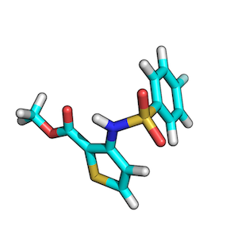
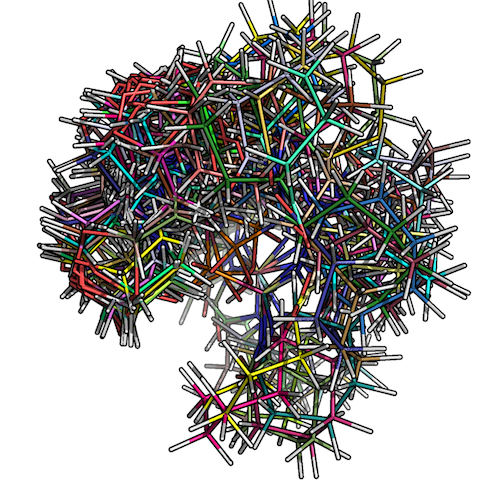
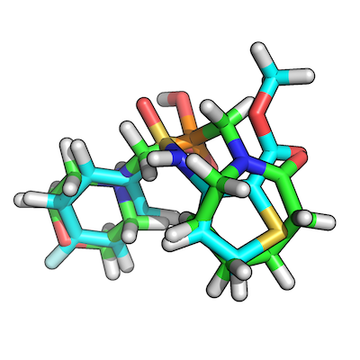

#Low-Energy Conformer Generation and Overlay

### Task:

We want to retrieve the best overlay between 2 molecules based on geometrical shape and functional chemistry.

**Requirements:**   
- OpenEye OMEGA2 and OpenEye ROCS  
- protein structure visualization tool (e.g., PyMOL)  
- Python 3.x  
- two molecules in `.mol2` format

### 1) Generate low-energy conformers of target and query

For this tutorial I will be using 2 randomly chosen molecules that I downloaded from the [ZINC](http://zinc.docking.org) database, which is a free database for commercially available compounds.

####ZINC00062008:

####ZINC00082321:

To find the best scoring overlay, I recommend to generate low-energy conformers of both target and query molecule via OpenEye's OMEGA2 tool first.

	/soft/linux64/openeye/bin/omega2\
        -in .../ZINC00062008.mol2\
        -out .../ZINC00062008_confs.mol2\
        -warts true\
        -fraglib /soft/linux64/openeye/data/omega2/fraglib.oeb.gz\
        -commentEnergy true\
        -prefix om2

The details about the algorithms behind OMEGA2 conformer generation can be found in the following paper by Paul C. D. Hawkins, A. Geoffrey Skillman, Gregory L. Warren, Benjamin A. Ellingson, and Matthew T. Stahl:  
[Conformer Generation with OMEGA: Algorithm and Validation Using High Quality Structures from the Protein Databank and Cambridge Structural Database](http://pubs.acs.org/doi/abs/10.1021/ci100031x)

If you want to know more about the different parameters for the command line interface, please refer to the [OpenEye OMEGA2 documentation](http://www.eyesopen.com/docs/omega/current/html/usage.html#command-line-interface)

The figure below shows how the low-conformer set for ZINC_00062008 would look like:

### 2) Overlaying low-energy conformers

Now, after we generated ~200 low-energy conformers (200 is the max. default value) for both the target and query molecule, we can use OpenEye ROCS to overlay all low-energy conformations with each other (= ~200 x ~200 overlays). Here, we are only interested in the top-scoring overlayed pair:  

	/soft/.../rocs\
        -query\
        -dbase\
        -randomstarts 20\ 
        -stats best\
        -besthits 0\ 
        -maxhits 0\
        -maxconfs 1\
        -rankby TanimotoCombo\
        -mcquery\
        -prefix rcs\
        -reportfile rocs.rpt\ 
        -oformat mol2\ 
        -report one\

It is worth mentioning that we are ranking by the `TanimotoCombo` here, which is a combination of `ShapeTanimoto` (3D shape similarity via volume optimization) and `ColorTanimoto` (functional group matching). Depending on your priorities, you may want to use a different argument for the `rankby` parameter. 
More information about the command line interface can be found at: [http://www.eyesopen.com/docs/rocs/current/html/usage.html#command-line-interface](http://www.eyesopen.com/docs/rocs/current/html/usage.html#command-line-interface).

### 3) Retrieving the best overlay-pair
Using the OpenEye ROCS command line interface with the parameters listed in the previous section, we will obtain a report file that contains our highest-scored overlay pair, which would be the 20th low-energy conformer of ZINC00082321 and the 168th low-energy conformer of ZINC00062008 in our example:

ROCS will also generate a `.mol2` file that includes all of the sampled overlays. Based on the report file, we know in which particular pair we are interested in, and thus we can just write a simple script to retrieve those 2 `.mol2` structures from the ROCS multimol2 outputfile, or just use a simple text search to locate the files and save them as individual `.mol2`s for visualization:  

 

The figure shows how our top-scoring overlay-pair would look like:

### 4) Script to automate the workflow

A simple script that is wrapping up the 2 steps mentioned above can be found here: [lowenergy_conf_overlay.py](./Scripts/lowenergy_conf_overlay.py)