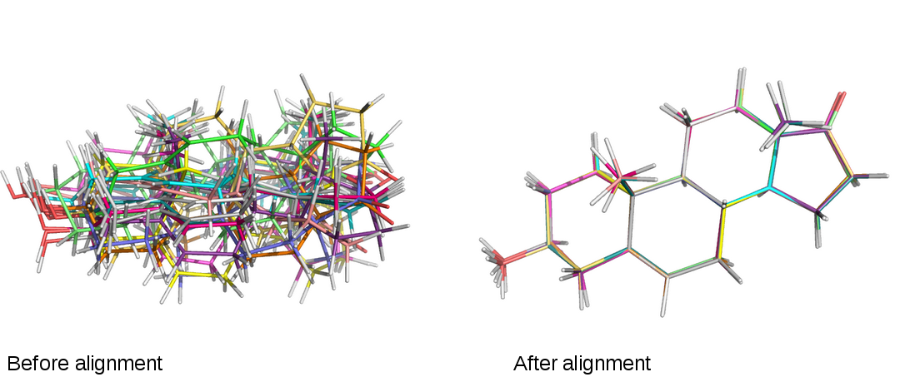

Useful scripts for working with protein files in FASTA, PDB, and MOL2 formats

###Table of Contents
- [Analysis](#analysis)
    - [`openeye_rmsd_align.py`](#openeye_rmsd_align-py)
- [File Conversion](#file-conversion)
    - [`pymol_mol2_to_pdb.py`](#pymol_mol2_to_pdb-py)
    - [`pdb_to_fasta.py`](#pdb_to_fasta-py)
- [File Processing](#file-processing)
    - [`fix_atomname_col.py`](#fix_atomname_col-py)
    - [`fasta_splitter.py`](#fasta_splitter-py)

 
 

## Analysis
[[back to top](#table-of-contents)]

 
 

### `openeye_rmsd_align.py`
[[back to top](#table-of-contents)]

**usage**: `python openeye_rmsd_align.py`  
 
Python 2.7 Script that utilizes Openeye's RMSD tool to align molecules in .pdb or  
.mol2 format to a reference molecule.  
Prints RMSD values of aligned molecules to the screen and writes aligned  
molecules to an user-specified output directory.

**Example:**
<pre>
[bash]~/Desktop >python openeye_align_rmsd.py
Note:
Uses Openeye RMSD tool with parameters:
-automorph true -overlay true

Enter the command to execute Openeye RMSD, e.g.,
/soft/openeye/oechem-utilities/rmsd

: /soft/openeye/oechem-utilities/rmsd

Directory with .mol2 and/or .pdb files
: Candidates_mol2

Path to the reference molecule
: Candidates_mol/1did_crystal.mol2
Sorry, this file doesn't exist. Please try again.

Path to the reference molecule
: Candidates_mol2/2dgd_crystal.mol2                       

Choose an output directory
: Candidates_mol2_aligned

...
/soft/openeye/oechem-utilities/rmsd: mols in: 1  out: 1
/soft/openeye/oechem-utilities/rmsd: confs in: 1  out: 1
2dgd(0) 2dgd_1(0): rmsd: 0.4755
...

</pre>

 
 

## File Conversion
[[back to top](#table-of-contents)]

 
 

### `pymol_mol2_to_pdb.py`
[[back to top](#table-of-contents)]

**usage**: `python pymol_mol2_to_pdb.py`  
 
Python 2.7 Script that utilizes PyMOL to convert protein structure files  
from .mol2 into .pdb file format.  
Prompts user for an input directory of MOL2 files and an  
output directory for PDB files.  

 
 

### `pdb_to_fasta.py`
[[back to top](#table-of-contents)]
The PDB to FASTA converter converts a protein structure file  
 into a linear protein amino acid sequence file. For more information  
 about the usage, please visit: http://sebastianraschka.com/Software/pdb_to_fasta_desktop.html

 
 

## File Processing
[[back to top](#table-of-contents)]

 
 

### `fix_atomname_col.py`
[[back to top](#table-of-contents)]

**usage**: `python fix_atomname_col.py`  
 
Some programs cannot process PDB files that have an atom name
starting in column 13.

This Python 2.7 script prompts the user for an input folder fixes all PDB files
in this folder that have an atom name starting in column 13. 
New files will be written to an output folder specified by the user.

**Excerpt from example PDB file before fixing:**

<pre>
ATOM     14  CG1 ILE A   2      15.063  45.663  12.445  1.00 11.60           C
ATOM     22 HG21 ILE A   2      17.230  46.291  14.308  1.00 11.43           H   
...
ATOM     23 HG22 ILE A   2      17.979  44.661  14.216  1.00 11.43           H

</pre>
**Excerpt from example PDB file after fixing:**

<pre>

ATOM     14  CG1 ILE A   2      15.063  45.663  12.445  1.00 11.60           C
ATOM     22  HG21ILE A   2      17.230  46.291  14.308  1.00 11.43           H   
...
ATOM     23  HG22ILE A   2      17.979  44.661  14.216  1.00 11.43           H
</pre>

 
 

### `fasta_splitter.py`
[[back to top](#table-of-contents)]

The FASTA file splitter reads in a FASTA file that consists of  
 multiple protein sequences and splits it into individual FASTA files,  
 which can be accepted as input by other software. For more information  
 about the usage, please visit: http://sebastianraschka.com/Software/fasta_file_splitter.html

