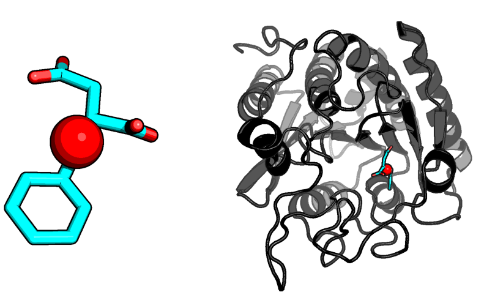
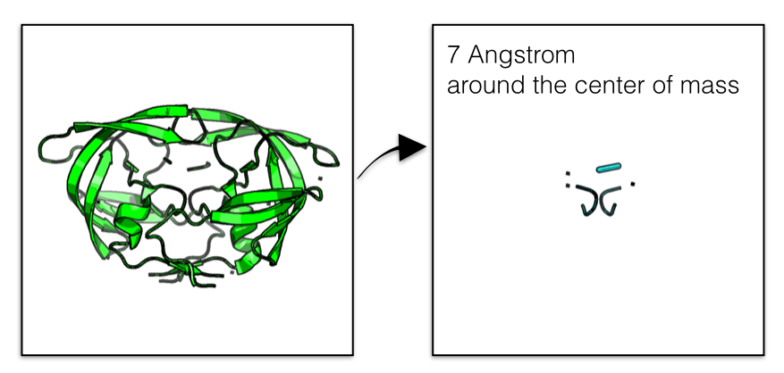
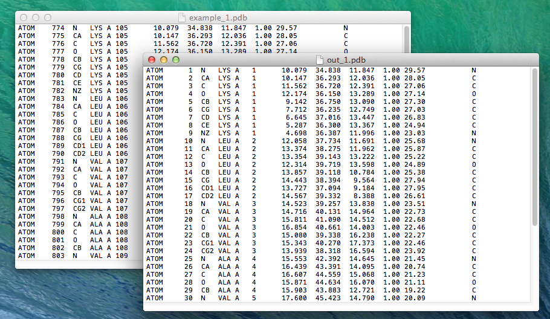
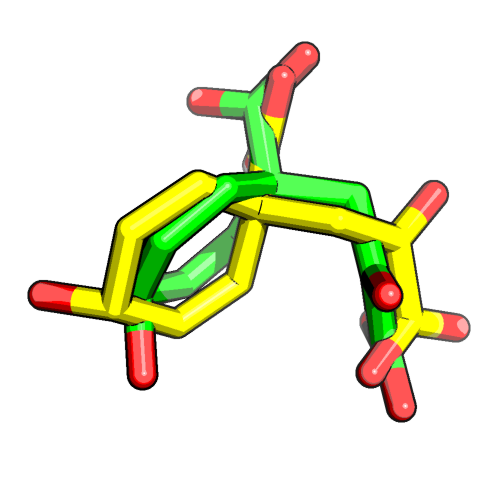
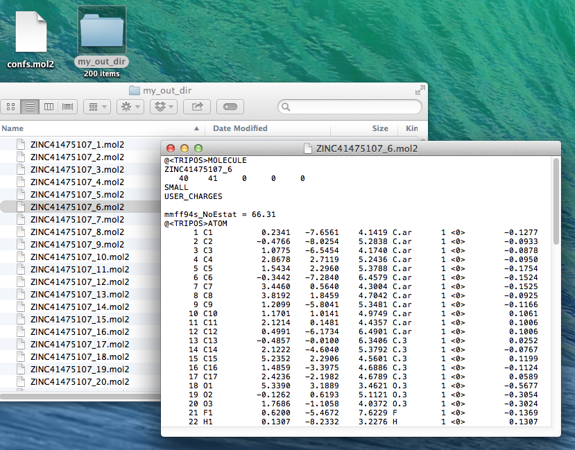

# protein-science - Scripts and Tools

A collection of useful scripts for working with protein files in FASTA, PDB, and MOL2 formats

- [center_of_mass.py](#center_of_masspy)
- [grab_atom_radius.py](#grab_atom_radiuspy)
- [pdb_to_fasta.py](#pdb_to_fastapy)
- [renumber_pdb.py](#renumber-pdbpy)
- [rmsd.py](#rmsdpy)
- [split_multimol2.py](#split_multimol2py)

I would be happy to hear your comments and suggestions. 
Please feel free to drop me a note via
[twitter](https://twitter.com/rasbt), [email](mailto:bluewoodtree@gmail.com), or [google+](https://plus.google.com/+SebastianRaschka).

**Please see the individual subdirectories for documentation**

 
 

## center_of_mass.py
[[back to top](#protein-science---scripts-and-tools)]

[Go to `center_of_mass.py`](./center_of_mass)

 
 

## grab_atom_radius.py
[[back to top](#protein-science---scripts-and-tools)]

[Go to `grab_atom_radius.py`](./grab_atom_radius)

 
 

## pdb_to_fasta.py
[[back to top](#protein-science---scripts-and-tools)]

[Go to `pdb_to_fasta.py`](./pdb_to_fasta)

 
 

## renumber_pdb.py
[[back to top](#protein-science---scripts-and-tools)]

[Go to `renumber_pdb.py`](./renumber_pdb)

 
 

## rmsd.py
[[back to top](#protein-science---scripts-and-tools)]

[Go to `rmsd.py`](./rmsd)

 
 

## split_multimol2.py
[[back to top](#protein-science---scripts-and-tools)]

[Go to `split_multimol2.py`](./split_multimol2)

