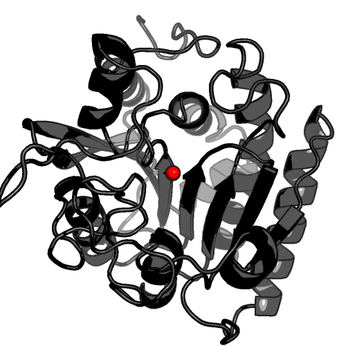

# protein-science - Scripts and Tools

## Center of Mass

Sebastian Raschka, 09/01/2014  
** Version 1.0**

 
 

I would be happy to hear your comments and suggestions. 
Please feel free to drop me a note via
[twitter](https://twitter.com/rasbt), [email](mailto:bluewoodtree@gmail.com), or [google+](https://plus.google.com/+SebastianRaschka).

 
 

The `center_of_mass.py` script calculates the weighted center of mass for PDB and PDBQT files.

Atomic mass units are considered for the weighted center of mass calculation, a list of those atomic weights can be found at [http://en.wikipedia.org/wiki/List_of_elements](http://en.wikipedia.org/wiki/List_of_elements)

 
 

### Requirements:

- Python 2.7.x or Python 3.x

 
 

### Usage:

run `python center_of_mass.py --help` for the usage information:

<pre>
usage: center_of_mass.py [-h] [-i coordinate-ID] PDBfile

Calculates the weighted center of mass for structures in a PDB file.
By default, all atoms in the PDB file are included in the calculation.

positional arguments:
  PDBfile

optional arguments:
  -h, --help            show this help message and exit
  -i coordinate-ID, --include coordinate-ID
                        Coordinate lines to include (default: "ATOM,HETATM")

</pre>

 
 

### Example 1: center of mass of a protein

command:

	python center_of_mass.py protein.pdb -i ATOM

output:

	[-8.125, 20.461, -10.438]

**Tip:**

You can generate a pseudo atom in PyMol (as shown in the image above) via the following code:

	pseudoatom com, resi=40, b=40, color=red, pos=[-8.125, 20.461, -10.438]

 
 
	
### Example 2: center of mass of a ligand

command:

	python center_of_mass.py protein.pdb -i HETATM

output:

	[-2.491, 30.038, -10.765]
	
