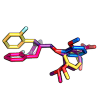
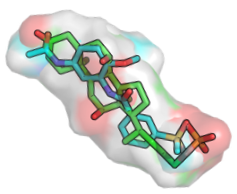

Sebastian Raschka, last updated: 21/07/2014

# Useful programs and tools for protein science

 
 

#Table of Contents

- [Protein-ligand docking and scoring](#protein-ligand-docking-and-scoring)
    - [AutoDock Vina](#autodock-vina)
    - [DrugScoreX](#drugscorex)
    - [LigScore](#ligscore)
    
- [Protein file and structure processing](#protein-file-and-structure-processing)
    - [OpenBabel](#openbabel)
    - [Reduce](#reduce)
    
- [Ligand structures](#ligand-structures)

	- [OMEGA](#omega)
	- [ROCS](#rocs)

- [Energy Minimization](#energy-minimization)
	- [Fast and efficient minimization via OpenEye Szybki](#fast-and-efficient-minimization-via-OpenEye-Szybki)
    
- [Crystal structure analysis](#crystal-structure-analysis)
	
	- [PyWater](#pywater) 
    
- [Mass Spectrometry](#mass-spectrometry)
    - [ProteoWizard](#proteowizard)
    - [OpenMS](#openms)

- [Libraries](#libraries)
    - [Biopython](#biopython)
    - [scikit-bio](#scikit-bio)

- [Genomics](#genomics)
	- [Prodigal](#prodigal)
	- [khmer](#khmer)
	- [epiviz](#epiviz)

 
 

I would be happy to hear your comments and suggestions. 
Please feel free to drop me a note via
[twitter](https://twitter.com/rasbt), [email](mailto:bluewoodtree@gmail.com), or [google+](https://plus.google.com/+SebastianRaschka).

 
 

## Protein-ligand docking and scoring
[[back to top](#table-of-contents)]

 
 

### AutoDock 4.2
[[back to top](#table-of-contents)]

**License**: free, open-source (GNU GPL)

A molecular docking and scoring tool that uses a computationally (relatively) inexpensive "hybrid" force field that contains terms based on molecular mechanics as well as empirical terms. The prediction of absolute binding energies may be less accurate compared to more computationally expensive, purely force field-based methods, but this semi-empirical approach is considered as well-suited for the relative rankings.

It was succeeded by AutoDock Vina, which replaced the semi-empirical force field by an entirely  knowledge-based, statistical scoring function. The authors highlight the improved speed and accuracy of AutoDock Vina, however, AutoDock 4.2 provides a more detailed output that might be useful for certain applications.

Website: [http://autodock.scripps.edu/downloads/autodock-registration/autodock-4-2-download-page/](http://autodock.scripps.edu/downloads/autodock-registration/autodock-4-2-download-page/)

*Huey, Ruth, Garrett M. Morris, Arthur J. Olson, and David S. Goodsell. 2007. “A Semiempirical Free Energy Force Field with Charge-Based Desolvation.” Journal of Computational Chemistry 28 (6): 1145–52. doi:10.1002/jcc.20634.*

**Usage for re-scoring:**  

Since the procedure involves several steps, please an usage example in [this separate document](https://github.com/rasbt/protein-science/blob/master/tutorials/scoring_functions_and_autodock/2014_autodock_energycomps.md#steps-for-estimating-binding-energies-via-autodock-42).

**Example output:**

	Total Intermolecular Interaction Energy          =  -3.1862 kcal/mol
	Total Intermolecular vdW + Hbond + desolv Energy =  -0.2499 kcal/mol
	Total Intermolecular Electrostatic Energy        =  -2.9362 kcal/mol
	Total Intermolecular + Intramolecular Energy     =  -5.6314 kcal/mol

	epdb: USER    Estimated Free Energy of Binding    =   -1.40 kcal/mol  [=(1)+(2)+(3)-(4)]
	epdb: USER    Estimated Inhibition Constant, Ki   =   94.72 mM (millimolar)  [Temperature = 298.15 K]
	epdb: USER    
	epdb: USER    (1) Final Intermolecular Energy     =   -3.19 kcal/mol
	epdb: USER        vdW + Hbond + desolv Energy     =   -0.25 kcal/mol
	epdb: USER        Electrostatic Energy            =   -2.94 kcal/mol
	epdb: USER    (2) Final Total Internal Energy     =   -2.45 kcal/mol
	epdb: USER    (3) Torsional Free Energy           =   +1.79 kcal/mol
	epdb: USER    (4) Unbound System's Energy  [=(2)] =   -2.45 kcal/mol

**Version:**

	AutoDock 4.2 Release 4.2.5.1 
	
 
 

### AutoDock Vina
[[back to top](#table-of-contents)]

**License**: free, open-source (Apache license)

The successor of AutoDock4.2 for docking and re-scoring protein-ligand complexes with a scoring function that estimates the binding affinities, as well as individual terms, such as hydrophobic contribution and hydrogen bonding.

Website: [http://vina.scripps.edu](http://vina.scripps.edu)

*O. Trott, A. J. Olson, AutoDock Vina: improving the speed and accuracy of docking with a new scoring function, efficient optimization and multithreading, Journal of Computational Chemistry 31 (2010) 455-461*

**Usage for re-scoring:**

	vina --config config.txt --score_only
	
Where a config.txt file has to be prepared for every protein-ligand complex, e.g.,

	
	receptor = protein.pdbqt
	ligand = ligand.pdbqt
	center_x = -2.491 # Center of Grid points X
	center_y = 30.038 # Center of Grid points Y
	center_z = -10.765 # Center of Grid points Z
	size_x = 25 # Number of Grid points in X direction
	size_y = 25 # Number of Grid points in Y Direction
	size_z = 25 # Number of Grid points in Z Direction
	
The required `pdbqt` files can be generated via e.g., [OpenBabel](#openbabel) or AutoDock's [MGLTools](http://mgltools.scripps.edu).  
For more details, please see the documentation for 

- [prepare_ligand4.py](http://autodock.scripps.edu/faqs-help/how-to/how-to-prepare-a-ligand-file-for-autodock4)
- [prepare_receptor4.py](http://autodock.scripps.edu/faqs-help/how-to/how-to-prepare-a-receptor-file-for-autodock4)

**Version:**

	vina --version
	AutoDock Vina 1.1.2 (May 11, 2011)

 
 

### DrugScoreX
[[back to top](#table-of-contents)]

**License**: free without any limitations (redistribution requires permission)

DrugScoreX is a new, independent DrugScore implementation with higher accuracy for scoring protein-ligand complexes. It's scoring function is based on statistical potentials.

Website: [http://pc1664.pharmazie.uni-marburg.de/drugscore/](http://pc1664.pharmazie.uni-marburg.de/drugscore/)

*DSX: A Knowledge-Based Scoring Function for the Assessment of Protein–Ligand Complexes
Gerd Neudert and Gerhard Klebe
Journal of Chemical Information and Modeling 2011 51 (10), 2731-2745*

**Usage:**

	dsx_mac_64.mac -h
	
	...

    pro_file    :  A pdb or mol2 file of your protein.
                  In pdb format metals in this file will be treated as part
                  of the protein. => Be sure to delete metals in the pdb file
                  if you want to supply some metals seperately (-M met_file)!
                  All other HETATMs will be ignored!
                  In mol2 format everything will be taken as part of the
                  protein. => Be sure to delete molecules you want to supply
                  seperately (-C, -W, -M) from the protein-mol2-file!
    lig_file    :  A mol2- or autodock dlg-file containing all molecules that
                  should be scored.
                  
    ... 
    
**Version:**
	
	dsx_mac_64.mac -h

 	+---------------------------------------------------------------------------+
 	| 'DSX'           Knowledge-based scoring function for the assessment       |
 	|                 of receptor-ligand interactions                           |
 	|  author     :   Gerd Neudert                                              |
 	|  supervisor :   Prof. Dr. G. Klebe                       ___    _ _       |
 	|  mailto     :   neudert@staff.uni-marburg.de             ))_    )\`)      |
 	|  version    :   0.88   (26.04.2011)                     ((_( o ((\( o     |
 	+---------------------------------------------------------------------------+

**Example:**

	dsx_mac_64.mac -P protein.pdb -L ligand.mol2 -D pdb_pot_0511
	
The directory with the PDB potentials is typically located in the main directory after downloading DrugScoreX

	dsx/
		ACC_DON_AnD_HYD_ARO_map.def	
		mac64/ 			  # directory that contains the binaries
		README.txt			
		pdb_pot_0511/     # potentials

 
 

### LigScore
[[back to top](#table-of-contents)]

**License**: free, open-source (GNU GPL)

Like DrugScore, a scoring function for protein-ligand complexes based on statistical potentials. It is available as standalone (IMP toolkit) and as webserver.  

The two flavors are RankScore, which is recommended for scoring different ligands in a protein-binding interface (e.g., for virtual screening), and PoseScore, for finding the optimal binding pose of a set of ligand decoys (i.e., the same ligand in different orientations/conformations).

Website: [http://salilab.org/imp/](http://salilab.org/imp/) (for IMP package)

Webserver: [http://modbase.compbio.ucsf.edu/ligscore/](http://modbase.compbio.ucsf.edu/ligscore/)

*Fan H, Schneidman-Duhovny D, Irwin J, Dong GQ, Shoichet B, Sali A. Statistical Potential for Modeling and Ranking of Protein-Ligand Interactions. J Chem Inf Model. 2011, 51:3078-92.*

**Usage**:

Requires installation of the IMP toolkit
	
	ligand_score -h
	Usage: ligand_score file.mol2 file.pdb [libfile]
	
Where `protein_ligand_pose_score.lib` is used for scoring different ligand poses (PoseScore) for the same protein-ligand complex, and `protein_ligand_rank_score.lib` (RankScore) is used to score different ligands for a given binding interface.

(On a Mac, the library files are typically located at: `/usr/local/share/IMP/atom/protein_ligand_pose_score.lib` and `/usr/local/share/IMP/atom/protein_ligand_rank_score.lib`) 

"Two different scoring files are provided:
    - protein_ligand_pose_score.lib for use when one wants to find the
    most near-native poses of a ligand from many geometry decoys of the
    same ligand
    - protein_ligand_rank_score.lib for use when screening a compound database
    against a single protein to choose putative binders"
    
Source: [http://svn.salilab.org/imp/trunk/applications/ligand_score/README.md](README.md)    
    
(On a Mac, the library files are typically located at: `/usr/local/share/IMP/atom/protein_ligand_pose_score.lib` and `/usr/local/share/IMP/atom/protein_ligand_rank_score.lib`)    

**Example:**

	ligand_score my.mol2 my.pdb /usr/local/share/IMP/atom/protein_ligand_pose_score.lib

**Version:**

Not individually available for `ligand_score`, see IMP version (IMP 2.2.0).

 
 
 
 

## Protein file and structure processing
[[back to top](#table-of-contents)]

 
 

### OpenBabel
[[back to top](#table-of-contents)]

**License**: free, open-source (GNU GPL)

A conversion tool for different file formats. Comes with standalone binaries and APIs for various programming languages.

Website: [http://openbabel.org](http://openbabel.org)

*O'Boyle, Noel M., Michael Banck, Craig A. James, Chris Morley, Tim Vandermeersch, and Geoffrey R. Hutchison. “Open Babel: An Open Chemical Toolbox.” J Cheminf 3 (2011): 33.*

**Usage:**

	babel -H
	Open Babel converts chemical structures from one file format to another

	Usage: babel <input spec> <output spec> [Options]
	
**Example:**

	babel -i mol2 my.mol2 -o pdbqt my.pdbqt

**Version:**

	babel
	No output file or format spec!
	Open Babel 2.3.1 -- Oct 13 2011 -- 15:14:47

 
 

### Reduce
[[back to top](#table-of-contents)]

**License**: free, but no particular license provided

A command-line tool that adds/removes hydrogen-atoms to/from proteins and ligands in PDB format.

Website: [http://kinemage.biochem.duke.edu/software/reduce.php](http://kinemage.biochem.duke.edu/software/reduce.php)

*Word, et al.(1999) "Asparagine and glutamine: using hydrogen atom contacts in the choice of sidechain amide orientation" J. Mol. Biol. 285, 1735-1747.*

**Usage:**

	~/Desktop >./reduce -h
	reduce: version 3.23 05/21/2013, Copyright 1997-2013, J. Michael Word
	reduce.3.23.130521
	arguments: [-flags] filename or -

	Suggested usage:
	reduce -FLIP myfile.pdb > myfileFH.pdb (do NQH-flips)
	reduce -NOFLIP myfile.pdb > myfileH.pdb (do NOT do NQH-flips)

	Flags:
	-FLIP             add H and rotate and flip NQH groups
	-NOFLIP           add H and rotate groups with no NQH flips
	-Trim             remove (rather than add) hydrogens

	-NUClear          use nuclear X-H distances rather than default
	                  electron cloud distances
	-NOOH             remove hydrogens on OH and SH groups
	-OH               add hydrogens on OH and SH groups (default)

	-HIS              create NH hydrogens on HIS rings
	-FLIPs            allow complete ASN, GLN and HIS sidechains to flip
	                        (usually used with -HIS)
	...
	
	
**Version:**

	reduce -v
	reduce.3.23.130521
	
	

## Ligand Structures
[[back to top](#table-of-contents)]

 
 	
	
	

### OMEGA
[[back to top](#table-of-contents)]

**License**: commercial and academic licenses
	
OpenEye OMEGA is a tool that uses a knowledge-based approach to generate hundreds of low-energy conformers of a ligand structure. The emphasis is on efficiency (approx. 2 sec/molecule on a machine with a 2.4 Ghz CPU, 4 GB RAM) and the quality of the generated conformers has been thoroughly validated. 

The approach for low-energy conformer generation by OMEGA can be described in 3 basic steps: First, the creation of an initial 3-dimensional structure based on a fragment library, generation of a large set of conformers based on the number of rotational torsion angles, and sampling using geometric criteria and a energy scoring function based on a simplified MMFF94 force field.
	
Website: [http://www.eyesopen.com/omega](http://www.eyesopen.com/omega)
	
*Hawkins, Paul C. D., A. Geoffrey Skillman, Gregory L. Warren, Benjamin A. Ellingson, and Matthew T. Stahl. “Conformer Generation with OMEGA: Algorithm and Validation Using High Quality Structures from the Protein Databank and Cambridge Structural Database.” Journal of Chemical Information and Modeling 50, no. 4 (April 26, 2010): 572–84. doi:10.1021/ci100031x.*	
	
	
**Example:**

	/soft/linux64/openeye/bin/omega2 \
	-in ligand.mol2 \
	-out confs.mol2 \
	-warts true \
	-fraglib /soft/linux64/openeye/data/omega2/fraglib.oeb.gz \
	-commentEnergy true	

- `-commentEnergy`: writes - conformer energy in kcal/mol to be written in the comment field for each conformer.
- `-warts true`: generates unique titles for conformers (appending underscore and the integer corresponding to the rank order number of the conformer in the final ensemble).

For more info, please use

- `omega2 --help simple`      : Get a list of simple parameters
- `omega2 --help all`         : Get a complete list of parameters

**Version:** Omega v. 3.14

 
 

### ROCS
[[back to top](#table-of-contents)]

**License**: commercial and academic licenses
	
OpenEye ROCS is a tool for overlaying chemical structures with a target molecule based on smilarities of shape and chemistry.

The rapid generation of overlays and its support for multiprocessing makes it a feasible tool for virtual screening - OpenEye reports that about 20-40 molecules per second can be overlayed using a single CPU of a standard computer (2.4 Ghz CPU, 4 GB RAM).

The result of a ROCS run consists of the overlayed compounds in common structure formats such as MOL2 as well as a report file with various different scores that can be used to rank the overlayed compounds based on volumetrical and chemistry matches.
	
Website: [http://www.eyesopen.com/rocs](http://www.eyesopen.com/rocs)
	
*Hawkins, P.C.D.; Skillman, A.G. and Nicholls, A., Comparison of Shape-Matching and Docking as Virtual Screening Tools, Journal of Medicinal Chemistry, Vol. 50, pp. 74-82, 2007.*	
	
	
**Example:**

	/soft/linux64/openeye/bin/rocs \
    -query query.mol2 \
    -dbase db.mol2 \
    -randomstarts 20 -stats best -besthits 0 -maxhits 0 -maxconfs 1 \
    -rankby TanimotoCombo \
    -mcquery \
    -prefix /home/user/my_dir/my_rocs_run \    
    -cutoff 0.5 \
    -reportfile /home/user/my_dir/my_rocs_run.rpt -oformat mol2 -report one
    

 
Detailed documentation and more command line options can be found [here](http://www.eyesopen.com/docs/rocs/current/html/usage.html#cmdoption-rocs-mcquery).

 
 

## Energy Minimization

 
 

### Fast and efficient minimization via OpenEye Szybki

#### Example:
 
An example for optimizing the hydrogen atoms in a protein-ligand complex. Here, only the protein hydrogen atoms in the 5-Angstrom neighborhood of the ligand (via `polarH 5`) are optimized as well as the ligand's hydrogen atoms (via `-optGeometry Honly`). Except for the hydrogen atoms, the ligand is treated as a rigid body that can undergo transitional and not conformational change during the optimization.
 
 
 	szybki -ligands <your_lig.mol2> \
 	-protein <your_prot.pdb> \
 	-out <out.mol2> \
 	-out_protein <prot.pdb> \
 	-optGeometry Honly \
 	-polarH 5
 	
See the [full documentation of OpenEye Szybki v. 1.8](http://www.eyesopen.com/szybki).	
 	
	
 
 

## Crystal structure analysis
[[back to top](#table-of-contents)]

 
 

### PyWater
[[back to top](#table-of-contents)]

**License**: free, open-source (MIT license)

A PyMOL plugin with a GUI and command line interface that finds conserved water molecules in a protein X-ray crystal structure.
	
Documentation and code: [https://github.com/hiteshpatel379/PyWATER](https://github.com/hiteshpatel379/PyWATER)	
	
	
 
 

## Mass Spectrometry
[[back to top](#table-of-contents)]

 
 

### ProteoWizard
[[back to top](#table-of-contents)]

**License**: free, open-source (no particular license mentioned)

A library of GUI and command line tools for proteomics analyses

Website: [http://proteowizard.sourceforge.net/index.shtml](http://proteowizard.sourceforge.net/index.shtml)

 
 

### OpenMS
[[back to top](#table-of-contents)]

**License**: free, open-source (BSD)

A C++ library for LC/MS data management and analysis.

Website: [http://open-ms.sourceforge.net](http://open-ms.sourceforge.net)

*Marc Sturm, Andreas Bertsch, Clemens Gröpl, Andreas Hildebrandt, Rene Hussong, Eva Lange, Nico Pfeifer, Ole Schulz-Trieglaff, Alexandra Zerck, Knut Reinert, and Oliver Kohlbacher, 2008.
“OpenMS – an Open-Source Software Framework for Mass Spectrometry”
BMC Bioinformatics 9: 163. doi:10.1186/1471-2105-9-163.*
	
	

## Libraries
[[back to top](#table-of-contents)]

 
 

### Biopython
[[back to top](#table-of-contents)]

**License**: free, open-source (very permissive custom license)

A collection of different tools written in Python

Website: [http://biopython.org/wiki/Main_Page](http://biopython.org/wiki/Main_Page)

 
 

### scikit-bio
[[back to top](#table-of-contents)]

**License**: free, open-source (BSD)

A Python package with various functions, data structures, and algorithms for biosciences written in Python.

Website: [http://scikit-bio.org](http://scikit-bio.org)

 
 

## Genomics
[[back to top](#table-of-contents)]

 
 

### Prodigal
[[back to top](#table-of-contents)]

**License**: free, open-source (GPL)

A fast Prokaryotic Dynamic Programming Genefinding Algorithm for identifying genes in a microbial genome.

Website: [http://prodigal.ornl.gov](http://prodigal.ornl.gov)

Webserver: [http://prodigal.ornl.gov/server.html](http://prodigal.ornl.gov/server.html)

*Hyatt D, Chen GL, Locascio PF, Land ML, Larimer FW, Hauser LJ. Prodigal: prokaryotic gene recognition and translation initiation site identification. BMC Bioinformatics. 2010 Mar 8;11(1):119.*

 
 

### khmer

**License**: free, open-source (BSD)

[[back to top](#table-of-contents)]

A library for assembling short-read DNA sequences via  k-mer counting, filtering and graph traversal FTW.

Website: [http://khmer.readthedocs.org](http://khmer.readthedocs.org)

*Crusoe et al., The khmer software package: enabling efficient sequence analysis. 2014.*

 
 

### epiviz

[[back to top](#table-of-contents)]

A web-tool for visualizing and comparing high-throughput Genome sequencing data.

Website: [http://epiviz.cbcb.umd.edu/](http://epiviz.cbcb.umd.edu/)

*Florin Chelaru, Llewellyn Smith, Naomi Goldstein, Héctor Corrada Bravo. Epiviz: interactive visual analytics for functional genomics data. Nature Methods, 2014; DOI: 10.1038/nmeth.3038*