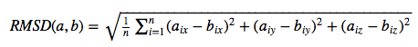
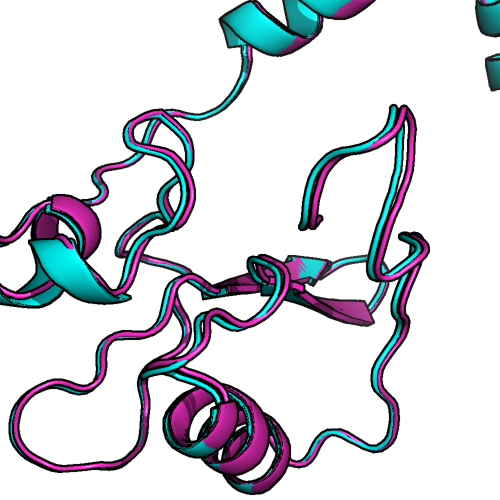

# protein-science - Scripts and Tools

## RMSD

 
 

The `rmsd.py` script calculates the root mean square deviation (RSMD) in Angstrom between two structures in PDB format.  
**Note that both PDB files have to contain the same number of atoms for the script to work.**

The RMSD measures the average distance between atoms of 2 protein or ligand structures via the equation

where *a_i* refers to the atoms of molecule 1, and *b_i* to the atoms of molecule 2, respectively. The subscripts *x, y, z* are denoting the x-y-z coordinates for every atom.

The RMSD is most commonly calculated without taking hydrogen-atoms into consideration (typically only C-alpha or main-chain atoms in proteins).

 
 

### Requirements:

- Python 2.7.x or Python 3.x

 
 

### Usage:

run `python rmsd.py --help` for the usage information:

<pre>
usage: rmsd.py [-h] [-l] [-c] [-ca] PDBfile1 PDBfile2

The RMSD measures the average distance between atoms 
of 2 protein or ligand structures.
By default, all atoms but hydrogen atoms of the protein are included in the RMSD calculation.
NOTE: Both structures must contain the same number of atoms in similar order.

positional arguments:
  PDBfile1
  PDBfile2

optional arguments:
  -h, --help     show this help message and exit
  -l, --ligand   Calculates RMSD between ligand (HETATM) atoms.
  -c, --carbon   Calculates the RMSD between carbon atoms only.
  -ca, --calpha  Calculates the RMSD between alpha-carbon atoms only.

Example:
rmsd.py ~/Desktop/pdb1.pdb ~/Desktop/pdb2.pdb
0.7377

</pre>

 
 

### Example 1: RMSD of 2 ligand poses

command:

	python rmsd.py pose1.pdb pose2.pdb --ligand

output:

	1.9959

 
 
	
### Example 2: between 2 peptides

command:

	python rmsd.py peptide1.pdb peptide.pdb

output:

	0.7377
	
